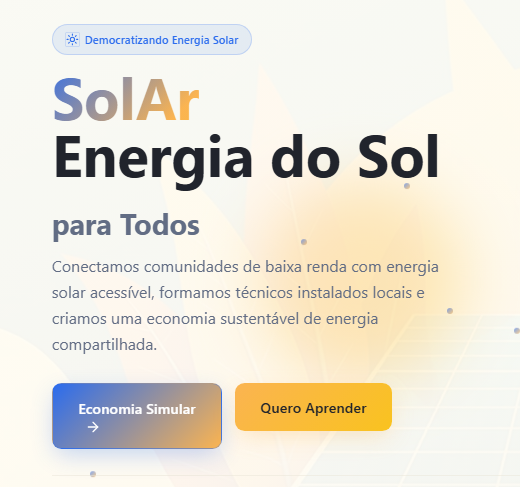

# SolAr — Energia do Sol para Todos

[](https://github.com/endeson12/projeto-solar-liga-jovem/actions/workflows/ci.yml)
[](https://www.typescriptlang.org/)
[](https://react.dev/)

[**Abrir demonstração pública →**](https://endeson12.github.io/projeto-solar-liga-jovem/)

MVP desenvolvido para o **Desafio Liga Jovem Sebrae**. A aplicação apresenta uma proposta de conexão entre comunidades, profissionais e empresas do setor de energia solar.



## Problema e proposta

O acesso à energia solar envolve decisões técnicas, comparação de fornecedores e estimativas financeiras. O SolAr reúne esses pontos em uma experiência única, orientada a usuários que desejam compreender possibilidades de economia e encontrar participantes do ecossistema local.

## Funcionalidades implementadas

- simulador de economia e dimensionamento solar;
- catálogo e página de detalhes de empresas;
- listagem e detalhes de comunidades energéticas;
- ranking SolarMatch;
- área de aprendizagem com módulos;
- autenticação local para demonstração;
- perfis de cliente, empresa e trabalhador;
- rotas protegidas por autenticação e papel;
- tema claro/escuro e interface responsiva;
- persistência local para os fluxos do MVP.

> Este repositório é um MVP frontend. Autenticação, dados e cálculos são demonstrativos e não substituem serviços de produção ou avaliação técnica especializada.

## Arquitetura

```text
src/
├── app/guards/          # proteção por autenticação e papel
├── components/          # layout, perfis e componentes de interface
├── domains/             # regras de autenticação e simulador
├── pages/               # páginas organizadas por funcionalidade
├── services/            # acesso e abstrações de dados
├── store/               # estado compartilhado
├── types/               # contratos TypeScript
└── utils/               # funções auxiliares
```

A separação por domínios mantém as regras do simulador e da autenticação independentes das páginas e dos componentes visuais.

## Stack

- React 18 e TypeScript
- Vite
- React Router
- Zustand
- React Hook Form e Zod
- Radix UI e Tailwind CSS
- Framer Motion
- Recharts
- Vitest e React Testing Library
- ESLint, Prettier, Husky e lint-staged
- GitHub Actions

## Execução local

Requisitos: Node.js 20 ou superior.

```bash
git clone https://github.com/endeson12/projeto-solar-liga-jovem.git
cd projeto-solar-liga-jovem
npm ci
npm run dev
```

O MVP não exige credenciais externas para iniciar. Configurações opcionais do simulador podem ser definidas em um arquivo `.env` a partir dos nomes documentados em `src/config/simulator.ts`.

## Qualidade

```bash
npm run lint
npm run typecheck
npm run test:ci
npm run build
```

A branch principal é validada por CI. O pipeline instala dependências de forma determinística e executa as verificações configuradas no projeto.

## Decisões e limitações

- **Persistência local:** permite demonstrar o fluxo sem infraestrutura externa, mas não oferece sincronização entre dispositivos.
- **Autenticação demonstrativa:** foi projetada para validar navegação e papéis, não para armazenar credenciais reais.
- **Cálculos do simulador:** servem para explorar a experiência do produto; tarifas e premissas precisam ser atualizadas para uso comercial.
- **Backend e pagamentos:** permanecem fora do escopo deste MVP.

## Próximas evoluções

- API e banco de dados para persistência multiusuário;
- autenticação segura no servidor;
- integração geográfica para comunidades e empresas;
- testes de ponta a ponta;
- auditoria de acessibilidade e performance.

## Licença

Distribuído sob a licença descrita em [LICENSE](LICENSE).
